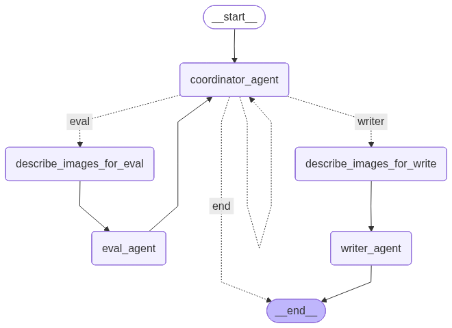

# Science Helpy 3.0

> **STATUS: ALPHA / PRE-MVP**
> Это самая ранняя альфа-версия проекта. Функционал пока очень урезан, возможны баги и нестабильная работа. Проект находится в стадии активного экспериментирования.

**Science Helpy 3.0** — это продвинутая мультиагентная система на базе Python и LangGraph для автоматизации работы с научными статьями (arXiv). Проект создан для Telegram-канала «who is AI?», чтобы помогать исследователям и энтузиастам быстро находить, оценивать и анализировать научные публикации.


*(Пример графа выполнения агентов)*

## Возможности

Система состоит из нескольких специализированных AI-агентов, работающих сообща:

1.  **Coordinator Agent ("Мозг"):**
    *   Понимает сложные запросы пользователя на естественном языке.
    *   Управляет процессом: ищет статьи, скачивает PDF, парсит текст.
    *   Делегирует задачи профильным агентам.
    *   *Инструменты:* arXiv API, PyMuPDF, Tavily Search.

2.  **Eval Agent (Рецензент):**
    *   Проводит строгую академическую оценку статьи по критериям ведущих конференций (ACL, NeurIPS).
    *   Оценивает: **Новизну**, **Методологию**, **Влияние**.
    *   Выдает структурированный вердикт (Accept/Reject) с обоснованием.

3.  **Writer Agent (Научный писатель):**
    *   Пишет глубокие, структурированные обзоры на русском языке.
    *   Выделяет ключевые инсайты, результаты экспериментов и практическую пользу.
    *   Может гуглить непонятные термины для контекста.

## Технологический стек

*   **Python 3.11+**
*   **LangGraph & LangChain:** Оркестрация мультиагентного взаимодействия.
*   **LLM Models:** Поддержка моделей через OpenRouter (DeepSeek, Llama 3, Qwen и др.) или OpenAI.
*   **Arxiv API:** Поиск и метаданные статей.
*   **PyMuPDF4LLM:** Качественное извлечение текста из PDF (с поддержкой Markdown разметки).
*   **Pydantic:** Валидация данных и структурированный вывод.

## 📦 Установка

1.  **Клонируйте репозиторий:**
    ```bash
    git clone https://github.com/your-username/science-helpy-3.git
    cd science-helpy-3
    ```

2.  **Создайте виртуальное окружение:**
    ```bash
    python -m venv venv
    source venv/bin/activate  # На Windows: venv\Scripts\activate
    ```

3.  **Установите зависимости:**
    ```bash
    pip install -r requirements.txt
    ```

4.  **Настройте переменные окружения:**
    Создайте файл `.env` в корне проекта и добавьте ключи API:
    ```env
    OPENROUTER_API_KEY=your_openrouter_key
    OPENROUTER_BASE_URL=https://openrouter.ai/api/v1
    TAVILY_API_KEY=your_tavily_key  # Для поиска в интернете (Writer Agent)
    ```

## Использование

Запустите главного координатора через CLI:

```bash
python science_helpy_3/graph_mas.py
```

**Примеры запросов:**
*   *"Найди последние статьи про Qwen3"*
*   *"Скачай технический отчет Qwen3 и оцени его"*
*   *"Напиши подробный обзор на эту статью"*

## 📂 Структура проекта

```
science_helpy_3/
├── agents/                 # Код агентов
│   ├── coordinator_agent.py
│   ├── review_agent.py
│   └── writer_agent.py
│   
├── agent_tools/            # Инструменты (Tools)
│   └── tools.py            # Поиск, скачивание, парсинг
├── downloads/              # Папка для скачанных PDF (в .gitignore)
└── graph_mas.py            # Точка входа и определение Графа
```

## 🤝 Вклад (Contributing)

Буду рад любым PR и Issues! Если у вас есть идеи по улучшению промптов или новые инструменты — welcome.

## 📜 Лицензия

MIT License.
